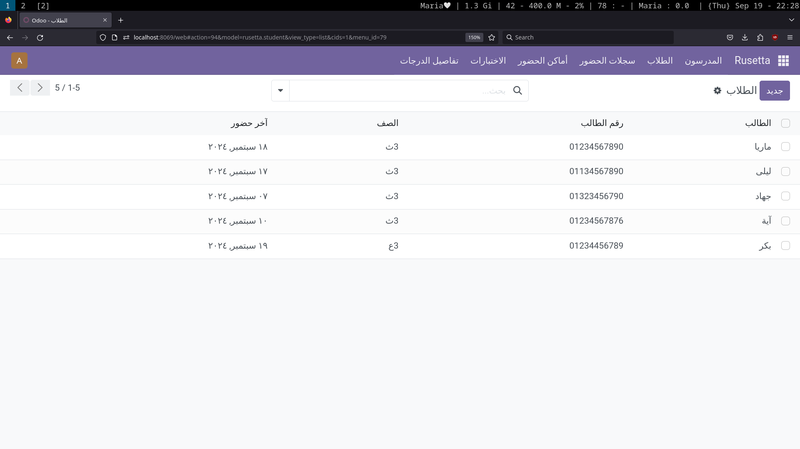
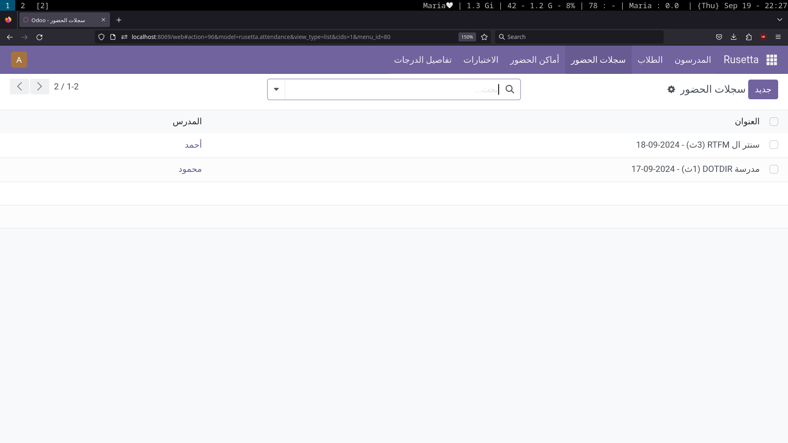
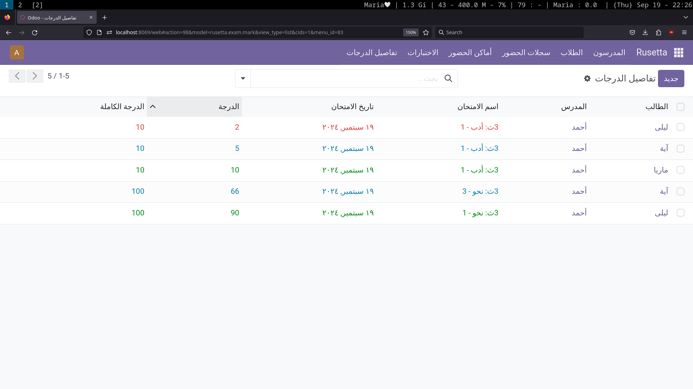

# Rusetta Assist Odoo Module

## Introduction

Welcome to the Rusetta Assist Odoo module! 🚀

This module is part of my journey of learning Odoo development. It manages basic student attendance, exam records, and marks, including:

- Recording students and their last attendance.
- Managing exams and assigning marks.
- Grouping and filtering based on teachers, exams, dates, and marks.

### Note:
This is not a professional module yet. It's simply a way to share what I am learning. I welcome any contributions, feedback, or suggestions! Remember: RTFM (Read The F*cking Manual) and KISS (Keep It Simple, Stupid!). 😊

## Screenshots

1. Student Record View

   

2. Attendance View

   

3. Exam View

   

## Installation

To install the Rusetta Assist module, you can choose one of the following methods:

1. *Clone the Repository:*

   Clone the rusetta_assist directory into your custom addons path:

2. *Odoo Apps Store:*

Alternatively, you can install the module directly from the Odoo Apps Store:

[Rusetta Assist on Odoo Apps](https://apps.odoo.com/apps/modules/17.0/rusetta_assist)

## Links

- [Odoo GitHub Repository](https://github.com/odoo/odoo)
- [Odoo 17.0 Installation from Source](https://www.odoo.com/documentation/17.0/administration/on_premise/source.html)

## How to Contribute

Feel free to fork this repository, raise issues, and create pull requests. I appreciate all contributions, especially those that stick to RTFM and KISS principles!
